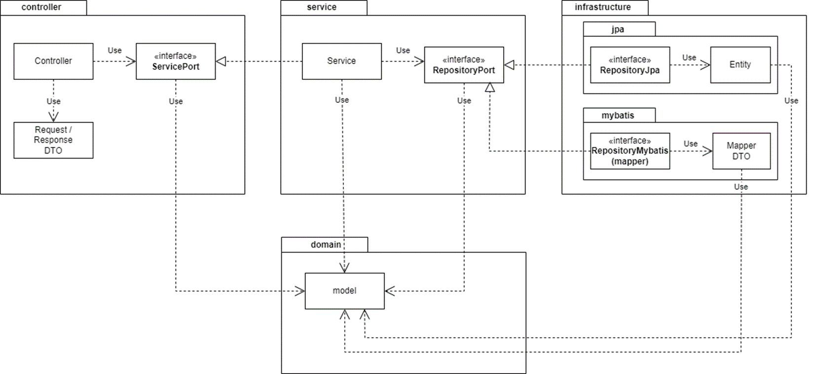

# 소프트웨어 아키텍처 
> 본 프로젝트의 설계는 계층 간 독립성 유지, 기술 의존성 최소화, 그리고 도메인 중심 설계를 중점에 두고 있습니다.

## 목차

1. [소프트웨어 아키텍처 구조](#1-소프트웨어-아키텍처-구조-)
2. [아키텍처의 주요 특징](#2-아키텍처의-주요-특징-)
    - [2.1 독립성](#21-독립성)
    - [2.2 용이성](#22-용이성)
    - [2.3 Domain 중심 설계](#23-domain-중심-설계)
    - [2.4 DTO 및 객체 변환 분리](#24-dto-및-객체-변환-분리)
3. [계층별 세부 설명](#3-계층별-세부-설명)
    - [3.1 Web Layer (웹 표현 계층)](#31-web-layer-웹-표현-계층)
    - [3.2 Service Layer (서비스 및 비즈니스 로직 계층)](#32-service-layer-서비스-및-비즈니스-로직-계층)
    - [3.3 Domain Layer (도메인 모델 계층)](#33-domain-layer-도메인-모델-계층)
    - [3.4 Infrastructure Layer (기반 기술 계층)](#34-infrastructure-layer-기반-기술-계층)

---

## 1. 소프트웨어 아키텍처 구조 
해당 아키텍처를 그림으로 표현하자면 아래와 같습니다.  

---

## 2. 아키텍처의 주요 특징 

### 2.1 **독립성**
- Web(controller) Layer는 ServicePort Interface와만 소통하고 Infrastructure Layer는 RepositoryPort Interface와 연결됩니다.
- Service와 Domain Layer는 데이터 형식이나 요청 방식의 변경에도 영향받지 않습니다.
- Spring **의존성 주입(DI)**으로 각 계층 간 결합도를 낮춤.

### 2.2 **용이성**
- Infrastructure Layer에서 JPA, MyBatis 등 구현 기술을 바꾸더라도 상위 레이어(Service, Controller)에는 영향이 없습니다.

### 2.3 **Domain 중심 설계**
- 도메인 모델(순수 Java 객체)이 중심이며 다른 계층과 독립적.
- 이는 애플리케이션의 비즈니스 로직이 데이터 저장소 또는 API 스펙과 무관하게 운영될 수 있음을 보장합니다.

### 2.4 **DTO 및 객체 변환 분리**
- Domain 객체가 외부 API나 데이터 저장소 형식에 맞춰 변경되는 것을 방지하기 위해 DTO와 객체 변환 계층을 둠.

---

## 3. 계층별 세부 설명

### 3.1 **Web Layer** (웹 표현 계층)
> 클라이언트로 요청을 받는 최상위 계층 입니다.  
> REST API 요청을 처리하며 `ServicePort(Interface)` 를 호출 합니다.  
> 해당 계층의 변경은 endPoint 설계 담당자 또는 frontend의 요구사항이 변경될 때 독립적으로 처리 됩니다.

- **ServicePort Interface**:
    - Service 세부 구현을 추상화합니다.
    - Service Layer Logic 이 변경되더라도 Web Layer(Controller)에는 영향을 주지 않도록 설계.

### 3.2 **Service Layer** (서비스 및 비즈니스 로직 계층)
> Domain Logic 호출 및 Infrastructure Layer 계층을 연결하는 역할을 수행 합니다.  

- **RepositoryPort Interface**: 기반기술 중 영속성 기술을 담당
    - 영속성(JPA, MyBatis 등)기술의 세부 구현을 추상화합니다.
    - 영속성 기술이 변경 되더라도 Service Layer의 호출 로직은 변하지 않습니다.

### 3.3 **Domain Layer** (도메인 모델 계층)
> 애플리케이션의 **핵심 규칙**과 도메인 상태를 나타냅니다.  
> `순수 Java 객체(POJO)`를 기반으로 설계되며, **비즈니스 로직**을 내포 합니다.  
> 도메인 객체는 영속성 기술과도 분리되어 있으므로 관계형 모델/기술(JPA 또는 MyBatis) 변경 시 그대로 유지됩니다.  

- **DTO 및 객체 변환**:
    - 본 프로젝트에서는 DTO를 각 Layer 별로 분리 하였습니다.
    - DTO <-> 도메인간 변환은 DTO 내부 메서드로 제공하였습니다. 

### 3.4 **Infrastructure Layer** (기반 기술 계층)
> 기반기술 계층의 경우 외부와의 통신을 답당합니다.  
> 기반기술로는 메시징,메일, 데이터 접근 등 많은 기반기술이 있으나  
> 본 프로젝트는 데이터 접근 역할을 주로 구현 하였습니다.

- **기술 선택의 유연성**:
    - JPA, MyBatis 등 구체적인 Persistence 기술은 내부적으로 구현되고 Repository Interface로 추상화.
    - 따라서 Service Layer는 기술 변경에 영향을 받지 않습니다.
